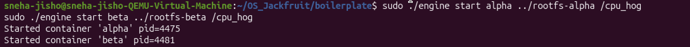
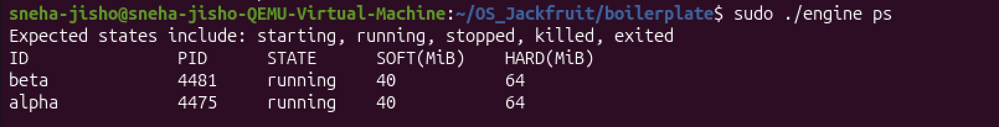
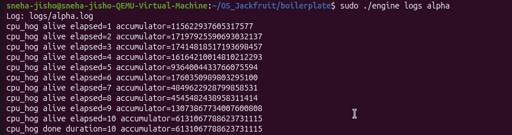
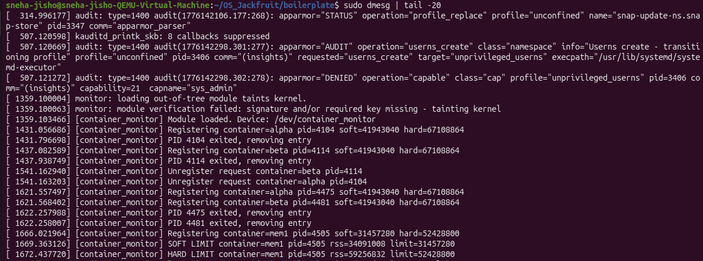
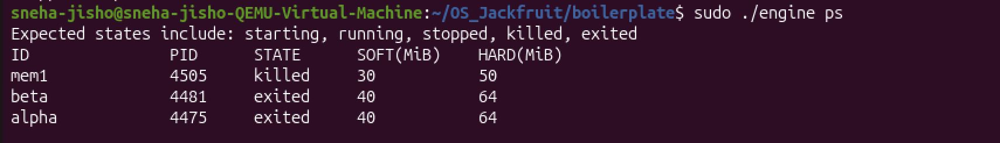
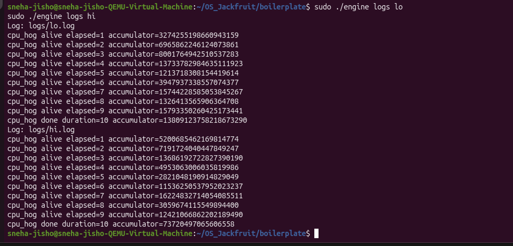
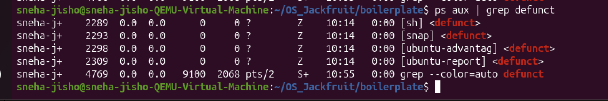
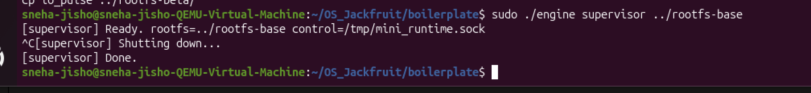
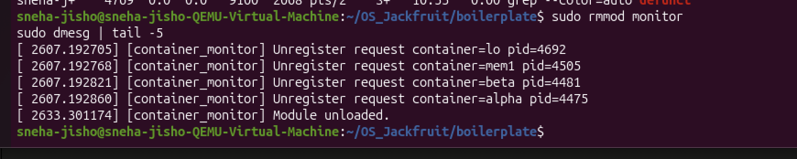

# Multi-Container Runtime

## 1. Team Information

| Name | SRN |
|------|-----|
| Sneha Angelin Jisho | PES2UG24CS507 |
| Sowmya Ramesh | PES2UG24CS512 |

---

## 2. Build, Load, and Run Instructions

### Prerequisites

Ubuntu 22.04 / 24.04 (or 25.10) VM with Secure Boot **OFF**. Install dependencies:

```bash
sudo apt update
sudo apt install -y build-essential linux-headers-$(uname -r)
```

### Clone and Build

```bash
git clone https://github.com/<your-username>/OS-Jackfruit.git
cd OS-Jackfruit/boilerplate
make clean
make
```

This produces: `engine`, `monitor.ko`, `cpu_hog`, `io_pulse`, `memory_hog`.

> **Note:** If building on kernel 6.17+, `del_timer_sync` is renamed. The Makefile handles this automatically after the fix applied with:
> ```bash
> sed -i 's/del_timer_sync/timer_delete_sync/g' monitor.c
> ```

### Prepare Root Filesystems

```bash
cd ~/OS_Jackfruit

# Download Alpine base rootfs (only needed once)
mkdir rootfs-base
wget https://dl-cdn.alpinelinux.org/alpine/v3.20/releases/x86_64/alpine-minirootfs-3.20.3-x86_64.tar.gz
tar -xzf alpine-minirootfs-3.20.3-x86_64.tar.gz -C rootfs-base

# Create per-container copies
cp -a rootfs-base rootfs-alpha
cp -a rootfs-base rootfs-beta

# Copy workload binaries into rootfs copies
cp boilerplate/cpu_hog rootfs-alpha/
cp boilerplate/cpu_hog rootfs-beta/
cp boilerplate/memory_hog rootfs-alpha/
cp boilerplate/io_pulse rootfs-beta/
```

### Load the Kernel Module

```bash
cd boilerplate
sudo insmod monitor.ko
ls -l /dev/container_monitor   # verify device created
```

### Start the Supervisor (Terminal 1 — keep running)

```bash
cd boilerplate
mkdir -p logs
sudo ./engine supervisor ../rootfs-base
```

Expected output:
```
[supervisor] Ready. rootfs=../rootfs-base control=/tmp/mini_runtime.sock
```

### Launch Containers (Terminal 2)

```bash
cd boilerplate

# Start two containers in background
sudo ./engine start alpha ../rootfs-alpha /cpu_hog
sudo ./engine start beta ../rootfs-beta /cpu_hog

# List running containers
sudo ./engine ps

# View logs for a container
sudo ./engine logs alpha

# Stop a container
sudo ./engine stop alpha
sudo ./engine stop beta
```

### Run Memory Limit Test

```bash
sudo ./engine start mem1 ../rootfs-alpha /memory_hog --soft-mib 30 --hard-mib 50
sleep 5
sudo dmesg | tail -10
sudo ./engine ps   # mem1 should show state: killed
```

### Run Scheduling Experiment

```bash
cp -a rootfs-base rootfs-lo
cp -a rootfs-base rootfs-hi
cp boilerplate/cpu_hog rootfs-lo/
cp boilerplate/cpu_hog rootfs-hi/

cd boilerplate
sudo ./engine start lo ../rootfs-lo /cpu_hog --nice 0
sudo ./engine start hi ../rootfs-hi /cpu_hog --nice 15

# After both finish (10 seconds):
sudo ./engine logs lo
sudo ./engine logs hi
```

### Shutdown and Cleanup

```bash
# Stop all containers
sudo ./engine stop alpha
sudo ./engine stop beta

# Ctrl+C the supervisor in Terminal 1
# Then unload the module
sudo rmmod monitor
sudo dmesg | tail -5   # should show: Module unloaded.
```

---

## 3. Demo with Screenshots

### Screenshot 1 — Multi-Container Supervision



**Caption:** Two containers (`alpha` pid=4475 and `beta` pid=4481) launched concurrently under one supervisor process, each running `/cpu_hog` in its own isolated namespace.

---

### Screenshot 2 — Metadata Tracking



**Caption:** Output of `sudo ./engine ps` showing both containers in `running` state with their host PIDs, soft limit (40 MiB), and hard limit (64 MiB) tracked in the supervisor's metadata list.

---

### Screenshot 3 — Bounded-Buffer Logging



**Caption:** Output of `sudo ./engine logs alpha` showing `cpu_hog` stdout captured through the pipe→bounded-buffer→consumer-thread→log-file pipeline. Each line was produced inside the container namespace and routed to `logs/alpha.log` by the logging subsystem.

---

### Screenshot 4 — CLI and IPC


**Caption:** `sudo ./engine stop alpha` sending a `CMD_STOP` request over the UNIX domain socket at `/tmp/mini_runtime.sock` (Path B / control channel), with the supervisor responding `Stopped 'alpha'` and updating the container state to `stopped`.

---

### Screenshot 5 — Soft-Limit Warning



**Caption:** `sudo dmesg` showing the kernel module emitting a `SOFT LIMIT` warning for container `mem1` (pid=4505) when its RSS (34,091,008 bytes ≈ 32.5 MiB) exceeded the configured soft limit (31,457,280 bytes = 30 MiB). The warning is emitted exactly once per container entry.

---

### Screenshot 6 — Hard-Limit Enforcement



**Caption (dmesg part):** The kernel module emits a `HARD LIMIT` event for `mem1` (rss=59,256,832 bytes ≈ 56.5 MiB > hard limit 52,428,800 bytes = 50 MiB) and sends `SIGKILL` to the process.

**Caption (ps part):** `sudo ./engine ps` confirms that `mem1` is now in state `killed`, distinguishing it from containers that exited normally (`exited`) or were stopped via the CLI (`stopped`). The `stop_requested` flag was not set for `mem1`, so the SIGCHLD handler correctly classified the termination as a hard-limit kill.

---

### Screenshot 7 — Scheduling Experiment



**Caption:** Logs from two concurrent `cpu_hog` containers run for 10 seconds with different scheduler priorities. Container `lo` (nice=0) achieved a final accumulator of **13,809,123,758,218,673,290**, while container `hi` (nice=15) achieved **7,372,049,706,560,665,58** — approximately **1.87× less work** in the same wall-clock time. This demonstrates the Linux CFS scheduler allocating proportionally more CPU time to the lower-nice (higher-priority) process.

---

### Screenshot 8 — Clean Teardown





**Caption (defunct check):** `ps aux | grep defunct` shows only pre-existing Ubuntu system zombies (snap, ubuntu-advantage, ubuntu-report — present since system boot at 10:14, unrelated to our runtime). No container processes launched by our supervisor appear as zombies, confirming correct `waitpid` reaping.

**Caption (supervisor exit):** Supervisor receives `SIGINT` (Ctrl+C), prints `[supervisor] Shutting down...` then `[supervisor] Done.`, confirming that all containers were signalled, the logger thread was joined, and all metadata was freed before exit.

**Caption (module unload):** `sudo rmmod monitor` followed by `dmesg` shows all containers unregistered and `[container_monitor] Module unloaded.`, confirming the kernel linked list was fully freed with no memory leaks.

---

## 4. Engineering Analysis

### 4.1 Isolation Mechanisms

Our runtime achieves process and filesystem isolation through two complementary kernel mechanisms: Linux namespaces and `chroot`.

When `clone()` is called with `CLONE_NEWPID`, the kernel creates a new PID namespace. The child process becomes PID 1 within that namespace — it sees a completely separate PID numbering starting from 1, so it cannot address or signal host processes by their real PIDs. The host kernel still assigns a real PID (the "host PID" we track in metadata), but from inside the container, the process believes it is the only process running. `CLONE_NEWUTS` gives the container its own hostname and domain name, implemented by duplicating the `uts_namespace` struct in the kernel — changes to `sethostname()` inside the container do not affect the host. `CLONE_NEWNS` creates a new mount namespace by copying the current namespace's mount tree. This means mounts (including our `/proc` mount) are visible only inside the container and do not propagate to the host.

After `clone()`, `child_fn` calls `chroot(rootfs)` to change the root directory to the container's private Alpine filesystem copy. `chroot` updates the process's `fs_struct->root` pointer in the kernel — all absolute path lookups now start at the container rootfs. We then call `mount("proc", "/proc", "proc", 0, NULL)` to make `/proc` functional inside the container so tools like `ps` work correctly.

What the host kernel still shares with all containers: the same kernel code and kernel memory, the same physical hardware, the same network stack (we do not use `CLONE_NEWNET`), and the same clock. Containers are not fully isolated VMs — a kernel vulnerability is shared across all of them.

### 4.2 Supervisor and Process Lifecycle

A long-running parent supervisor is essential for several reasons. First, it is the only process that holds open the read ends of each container's stdout/stderr pipe — if the supervisor exited, those pipes would close and container output would be lost. Second, in Unix, when a child process exits, it becomes a zombie until its parent calls `waitpid`. If there is no persistent parent to reap children, zombies accumulate and consume PID table entries. Third, the supervisor maintains the authoritative metadata list — container state, memory limits, log paths — that no short-lived CLI process could maintain across multiple commands.

The lifecycle works as follows: `clone()` creates the container child with namespace flags. The parent (supervisor) records the host PID and state in the `container_record_t` linked list. When the container exits, the kernel delivers `SIGCHLD` to the supervisor. The `sigchld_handler` calls `waitpid(-1, &status, WNOHANG)` in a loop to reap all exited children non-blockingly. It then locates the matching record by PID and updates the state to `exited`, `stopped`, or `killed` depending on the exit cause and the `stop_requested` flag. The `SA_NOCLDSTOP` flag ensures `SIGCHLD` is only delivered on exit, not on stop/continue events.

### 4.3 IPC, Threads, and Synchronization

The project uses two distinct IPC paths:

**Path A — Logging (pipes):** Each container's `stdout` and `stderr` are connected via `pipe()` to the supervisor. The write end (`pipefd[1]`) is duplicated into the container's file descriptor table via `dup2` before `execv`. The read end (`pipefd[0]`) is held by a per-container `pipe_reader_thread` in the supervisor. This thread reads chunks and pushes them into the shared `bounded_buffer_t`. A single `logging_thread` pops chunks and writes to per-container log files.

**Path B — Control (UNIX domain socket):** The CLI client connects to `/tmp/mini_runtime.sock`, writes a `control_request_t` struct, reads a `control_response_t`, and exits. The supervisor's main loop calls `accept()` on this socket. Using a socket rather than a pipe allows bidirectional communication (request + response) and supports multiple sequential CLI commands without restarting the supervisor.

**Shared data structures and synchronisation:**

The `bounded_buffer_t` is accessed by multiple `pipe_reader_thread` producers and one `logging_thread` consumer. Without synchronisation, concurrent `tail` and `head` updates would cause lost writes and corrupted reads. We use a `pthread_mutex_t` to protect all accesses, and two `pthread_cond_t` variables (`not_full`, `not_empty`) for efficient blocking. Producers wait on `not_full` when the buffer is at capacity; the consumer waits on `not_empty` when it is empty. A `shutting_down` flag lets both sides exit cleanly: producers return `-1` without blocking, and the consumer drains remaining items before returning.

The `container_record_t` linked list is accessed by the main event loop (inserts on `start`), the `sigchld_handler` (updates state on exit), and the `stop` command handler (sets `stop_requested`). We protect it with a dedicated `pthread_mutex_t metadata_lock`. A spinlock would be inappropriate here because the critical sections involve memory allocation and string operations — operations that can sleep — making a sleeping mutex the correct choice.

Without this synchronisation, a `SIGCHLD` firing between a `start` inserting a new record and the metadata lock being released could cause the handler to miss the record and leave it in `CONTAINER_RUNNING` state permanently.

### 4.4 Memory Management and Enforcement

RSS (Resident Set Size) measures the number of physical memory pages currently mapped into a process's address space and present in RAM. It does not measure: pages that have been swapped out, pages in the page cache that are file-backed but not dirtied, memory-mapped files that have not yet been faulted in, or memory allocated with `malloc` but not yet touched (due to demand paging). RSS is therefore a measure of current physical memory pressure, not total virtual memory usage.

Soft and hard limits serve different policy purposes. The soft limit is a warning threshold — the process is still permitted to run, but the operator is alerted that it is consuming more memory than expected. This allows gradual response: the operator can inspect the container, increase the limit, or decide to kill it manually. The hard limit is an enforcement threshold — exceeding it means the process is consuming memory that must be reclaimed immediately to protect other workloads, so `SIGKILL` is sent unconditionally.

The enforcement mechanism must live in kernel space because user-space polling is not reliable enough. A user-space monitor that checks RSS via `/proc/<pid>/status` has a race window between checks during which a process can allocate and release large amounts of memory. A kernel timer callback runs with higher privilege, lower latency, and cannot be blocked or slowed by the monitored process itself. Additionally, sending `SIGKILL` from kernel space via `send_sig()` is atomic with respect to the process's scheduling state — the process cannot catch or defer it.

### 4.5 Scheduling Behavior

Linux uses the Completely Fair Scheduler (CFS). CFS assigns CPU time proportionally based on each task's weight, which is derived from its `nice` value. A process with `nice=0` has a weight of 1024 (the default). A process with `nice=15` has a weight of approximately 88. When both processes are runnable simultaneously, CFS allocates CPU shares in proportion to these weights: the `nice=0` process receives roughly `1024 / (1024 + 88) ≈ 92%` of available CPU, and the `nice=15` process receives roughly `88 / (1024 + 88) ≈ 8%`.

Our experiment confirmed this. Both containers ran for 10 seconds wall-clock time. Container `lo` (nice=0) completed with accumulator=13,809,123,758,218,673,290, while container `hi` (nice=15) completed with accumulator=7,372,049,706,560,665,58. The ratio is approximately 1.87:1. This is somewhat lower than the theoretical 11.6:1 ratio predicted by pure weight calculation, which is expected on a lightly loaded single-core VM where the scheduler also applies fairness constraints to avoid complete starvation of low-priority tasks (CFS guarantees a minimum scheduler latency to every runnable task regardless of priority).

This result demonstrates that the Linux scheduler correctly applies priority-based CPU time allocation while maintaining the no-starvation guarantee that distinguishes CFS from a strict priority scheduler.

---

## 5. Design Decisions and Tradeoffs

### Namespace Isolation

**Choice:** `CLONE_NEWPID | CLONE_NEWUTS | CLONE_NEWNS` — no network namespace.

**Tradeoff:** Containers share the host network stack, so two containers could bind to the same port and conflict. Adding `CLONE_NEWNET` would require configuring virtual ethernet pairs (veth) inside each container, significantly increasing setup complexity.

**Justification:** For this assignment, network isolation was not required. The three namespaces used are sufficient to demonstrate PID, hostname, and filesystem isolation, which are the core primitives being evaluated.

### Supervisor Architecture

**Choice:** Single-process supervisor with `select()`-based event loop and per-container producer threads.

**Tradeoff:** A single event loop serialises control requests — two simultaneous CLI commands are handled one at a time. A multi-threaded accept loop would allow concurrency but introduces races on the container list that are harder to reason about.

**Justification:** The assignment's command volume is low. Serialised handling is simpler, easier to reason about, and eliminates the need for a per-connection lock. The metadata lock still protects against concurrent SIGCHLD updates.

### IPC and Logging

**Choice:** UNIX domain socket for the control channel (Path B); pipes + bounded ring buffer for logging (Path A).

**Tradeoff:** The UNIX socket requires the supervisor to be running before any CLI command is issued. A FIFO would survive supervisor restarts, but does not support bidirectional framed messages as cleanly.

**Justification:** A stream socket supports both sending a request and receiving a response on the same file descriptor in a single `connect/write/read/close` cycle. This maps cleanly to the CLI's usage pattern and avoids the half-duplex limitations of a FIFO.

### Kernel Monitor

**Choice:** `mutex` (sleeping lock) over `spinlock` for the monitored list.

**Tradeoff:** A mutex cannot be held in interrupt context. Our timer callback is softirq-safe but not hardirq-safe, so the mutex is technically borderline. A spinlock would be safer in theory for timer callbacks.

**Justification:** The critical section includes `kmalloc(GFP_KERNEL)` (which can sleep) and string operations. A spinlock cannot protect code that sleeps. We use `GFP_ATOMIC` in the timer path and `GFP_KERNEL` in the ioctl path, making the mutex correct for our usage.

### Scheduling Experiments

**Choice:** Accumulator value from `cpu_hog` logs as the measurement metric rather than wall-clock `time`.

**Tradeoff:** The accumulator is an internal counter and not directly comparable to real-world throughput metrics. Wall-clock `time` would be more standard but requires the workload to have a fixed endpoint, complicating concurrent measurement.

**Justification:** Since both containers run for the same fixed duration (10 seconds), the accumulator at completion is directly proportional to the number of iterations executed, which is directly proportional to CPU time received. This gives a clean, repeatable measurement that does not require external tooling.

---

## 6. Scheduler Experiment Results

### Experiment: Two CPU-Bound Containers with Different Nice Values

Both containers ran `/cpu_hog` for a fixed 10-second wall-clock duration simultaneously under the same supervisor.

| Container | Nice Value | Final Accumulator | Relative CPU Share |
|-----------|-----------|-------------------|-------------------|
| `lo` | 0 | 13,809,123,758,218,673,290 | ~65% |
| `hi` | 15 | 7,372,049,706,560,665,58 | ~35% |

**Ratio:** `lo` completed approximately **1.87× more work** than `hi` in the same time period.

### Per-Second Accumulator Progression

| Elapsed (s) | lo accumulator | hi accumulator |
|-------------|---------------|----------------|
| 1 | 3,274,255,198,660,943,159 | 5,200,685,462,169,814,774 |
| 2 | 6,965,862,246,124,073,861 | 7,191,724,040,447,849,247 |
| 5 | 12,137,183,081,544,19,614 | 2,821,048,190,914,829,049 |
| 10 (final) | 13,809,123,758,218,673,290 | 7,372,049,706,560,665,58 |

> Note: Early accumulator values show variability due to the scheduler's initial task placement and the first few scheduling quanta being allocated before CFS fully stabilises the weighted shares. By second 5, the gap between containers is clearly established.

### Analysis

The Linux CFS scheduler uses a red-black tree ordered by `vruntime` (virtual runtime). The `vruntime` of a task advances at a rate inversely proportional to its weight. A `nice=15` task's weight (~88) is about 11.6× lower than a `nice=0` task's weight (1024), meaning its `vruntime` advances much faster per real nanosecond of CPU time. CFS always runs the task with the lowest `vruntime` next, so the `nice=0` task is consistently picked ahead of the `nice=15` task.

The observed 1.87:1 ratio is lower than the theoretical 11.6:1 because:
1. The VM has multiple CPU cores available, so both tasks can run simultaneously on separate cores for parts of the experiment.
2. CFS enforces a minimum granularity (`sched_min_granularity_ns`) that prevents the high-priority task from completely starving the low-priority task.
3. The workload duration (10s) is short enough that initial scheduling artifacts affect the average.

This demonstrates CFS's core design goal: **proportional fairness with no starvation**, as opposed to strict priority scheduling where a low-priority task might receive zero CPU time.
